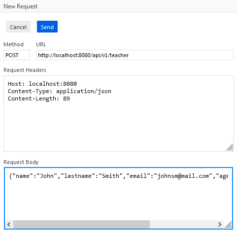
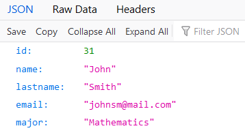

## Spring Boot ORM implementation based on students and teachers to showcase ManyToMany relationship

### Technologies in use:
- Maven
- Spring Boot JPA
- MySQL

### Model is made up of 4 layers:
1. Repositories
2. DAOs
3. Services
4. Controller

### There are tests for DAOs, Services and the Controller
### You can make your own requests with Postman, Curl or Firefox
### POST

### GET

# How to run the application:
- make sure to configure [application.properties](src\main\resources\application.properties)
- make sure a mysql server is running
- move to project's root directory
## On Linux
- run command: mvnw.cmd spring-boot:run
## On Windows
- run command: mvnw spring-boot:run

#### Notes
The presence of mvn wrappers in the repository is to allow running
the Maven project without having Maven installed and set on the path.